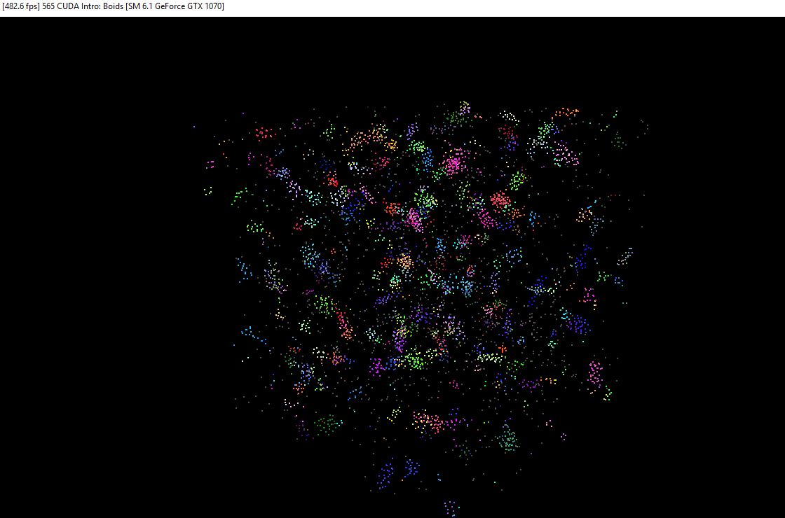
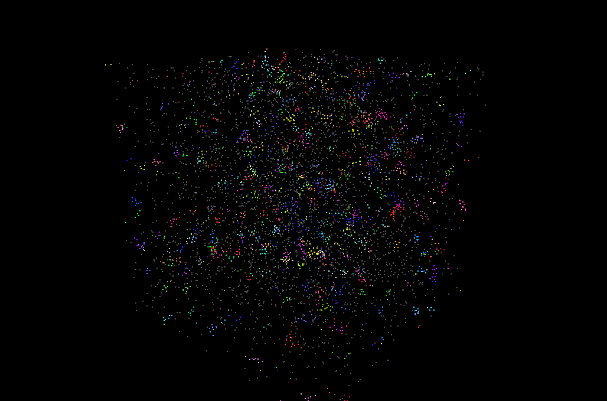
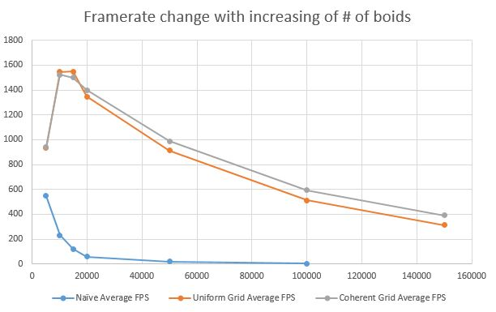
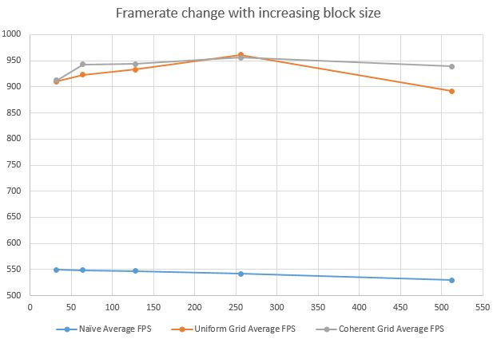
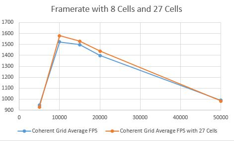

**University of Pennsylvania, CIS 565: GPU Programming and Architecture,
Project 1 - Flocking**

* Wanru Zhao, 59981278
  * [LinkedIn](www.linkedin.com/in/wanru-zhao).
* Tested on: Windows 10, Intel(R) Xeon(R) CPU E5-1630 v4 @ 3.70GHz, GTX 1070 (SIG Lab)

### Screenshots

Screenshot of flocking boids

GIF

### Performance Analysis
#### Framerate change with increasing number of boids

Number of Boids | Navie | Uniform Grid | Coherent Grid
:---|:---:|:---:|:---:
5000 | 547.471 | 932.684 | 943.434
10000 | 230.529 | 1546.9 | 1521.98
15000 | 120.268 | 1549.28 | 1498.19
20000 | 57.9549 | 1347.32 | 1398.56
50000 | 19.7976 | 912.897 | 988.624
100000 | 2.7 | 510.311 | 593.427
150000 | Crash | 313.939 | 391.472

#### Framerate change with increasing block size with 5000 boids

Block Size | Navie | Uniform Grid | Coherent Grid
:---|:---:|:---:|:---:
32 | 549.209 | 910.022 | 912.538
64 | 548.936 | 923.373 | 942.928
128 | 547.471 | 932.684 | 943.434
256 | 541.605 | 961.5 | 956.118
512 | 529.656 | 891.667 | 939.112

#### Framerate change with 8 Cells and 21 Cells, block size = 128, Coherent Grid

Number of Boids | 8 Cells | 21 Cells
:---|:---:|:---:
5000 | 943.434 | 925.261
10000 | 1521.98 | 1579.39
15000 | 1498.19 | 1529.99
20000 | 1398.56 | 1438.4
50000 | 988.624 | 981.994

### Problems

* For each implementation, how does changing the number of boids affect performance? Why do you think this is?

For Naive method, as number of boids increase, the average FPS drops, while fps of uniform and coherent grid firstly increases and then drops, since there are more boids needed to be calculated as neighbors which influence every boid. For grid ones, when the number of boids is not large enough, the cost of computing grids reduces the performance, however, this cost can be neglected when number of boids is large.

* For each implementation, how does changing the block count and block size affect performance? Why do you think this is?

When the block size increases, the average FPS for each method does not change a lot. For Naive, the performance drops, and for grid methods, the performance increases at first and then drops slightly. The warp size is 32 and the number of SMs is 15 for the computer I used. I think the reason for performance decreasing is due to the warp size.

* For the coherent uniform grid: did you experience any performance improvements with the more coherent uniform grid? Was this the outcome you expected? Why or why not?

Yes. When the number of boids is larger than 50000, the performance of coherent grid is better than scattered grid. Since the searching step for shuffled boid indices is skipped.

* Did changing cell width and checking 27 vs 8 neighboring cells affect performance? Why or why not? Be careful: it is insufficient (and possibly incorrect) to say that 27-cell is slower simply because there are more cells to check!

The performance of 27-cell is slightly better than 8-cell when number of boids is within some range. Within this range, the cost of determining which cell should be considered as neighbor of current cell is slightly larger than the cost of iterating more cells.
